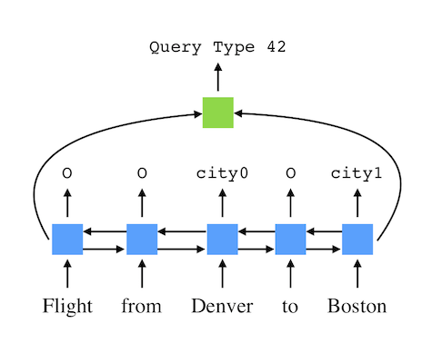

This directory contains a simple baseline approach for mapping text to SQL:

- Identify an SQL template for this question
- Choose which words will fit which slots in the template

The model is a bi-directional LSTM that



Given our observation of overlap between train and test splits for the standard data, this is a simple baseline that clearly doesn't generalise, but may be very effective:

- Convert the data into a set of templates where the only variables in the templates are words that occur in the input
- Run a tagger over the input, where the tags are the slots words need to fill, and the tagger also chooses a template

If you use this code, please cite our ACL paper:

```TeX
@InProceedings{data-sql-advising,
  author    = {Catherine Finegan-Dollak, Jonathan K. Kummerfeld, Li Zhang, Karthik Ramanathan, Sesh Sadasivam, Rui Zhang, and Dragomir Radev},
  title     = {Improving Text-to-SQL Evaluation Methodology},
  booktitle = {Proceedings of the 56th Annual Meeting of the Association for Computational Linguistics (Volume 1: Long Papers)},
  month     = {July},
  year      = {2018},
  address   = {Melbourne, Victoria, Australia},
  pages     = {},
  url       = {},
}
```


## Requirements

- [Dynet](dynet.readthedocs.io) for python

## Running

For all arguments etc, run:

```
./baseline.py --help
```

To run with all the defaults, simply do:

```
./baseline.py <data_file>
```

Initial results on the development set (% of cases where we get the right template and identify all variables) are:

Dataset  | Oracle | Current Score
-------- | ------ | ------
GeoQuery | 82     | 47
Advising | 99     | 75
ATIS     | 89     | 65
Scholar  | 91     | 55

## License

This code is a modified version of the example [tagger code](https://github.com/clab/dynet/blob/master/examples/tagger/bilstmtagger.py) from the DyNet repository.
